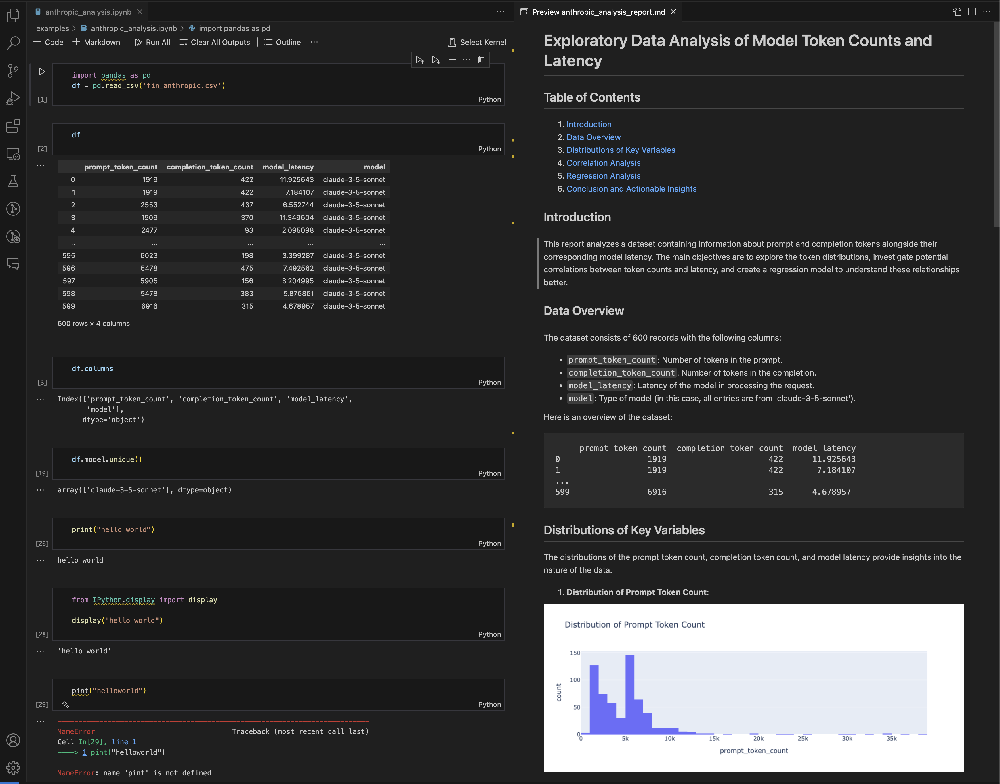

# smart-nbconvert
smart-nbconvert is a tool for automatically generating detailed reports from Jupyter Notebooks with the help of LLMs. This python script processes the notebook, notebook, extracts key content, and converts it into a structured markdown report. It also handles inline images, etc.


## Installation
```bash
pip install -r requirements.txt
```

## Usage
```bash
# export your openai key if you haven't already
export OPENAI_API_KEY="your_openai_api_key"

# simple usage
python smart_nbconvert.py --notebook examples/anthropic_analysis.ipynb

# more controls
python smart_nbconvert.py \
  --notebook examples/anthropic_analysis.ipynb \
  --model gpt-4o \
  --instructions "How to reduce latency" \
  --output report.md
```

## Example input/output


## License
MIT License